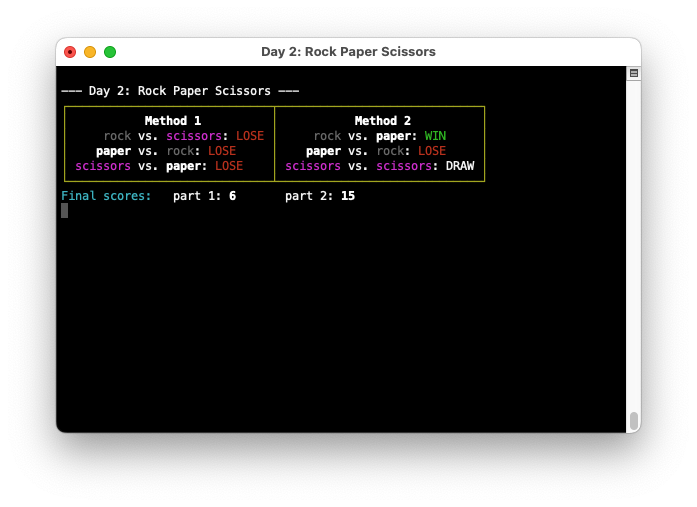
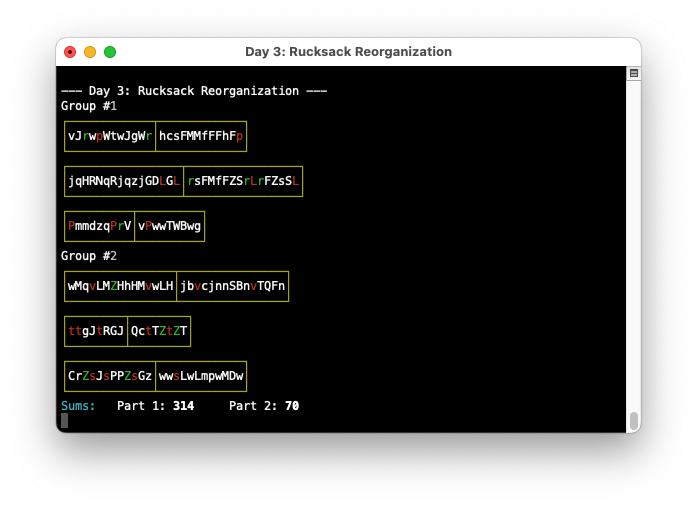

# Advent of Code 2022

My solutions to the 2022 [Advent of Code](https://adventofcode.com/)

## Day 1: [Calorie Counting](https://adventofcode.com/2022/day/1)

Solution: [calories.py](1/calories.py)

## Day 2: [Rock Paper Scissors](https://adventofcode.com/2022/day/2)

Solution: [rock-paper-scissor.py](2/rock-paper-scissor.py)

## Day 3: [Rucksack Reorganization](https://adventofcode.com/2022/day/3)

Solution: [rucksack.py](3/rucksack.py)

## Day 4: [Camp Cleanup](https://adventofcode.com/2022/day/4)

Solution: [cleanup.py](4/cleanup.py)

## Day 5: [Supply Stacks](https://adventofcode.com/2022/day/5)

Solution: [stacks.py](5/stacks.py)

## Day 6: [Tuning Trouble](https://adventofcode.com/2022/day/6)

Solution: [tuning.py](6/tuning.py)

## Day 7: [No Space Left On Device](https://adventofcode.com/2022/day/7)

Solution: [filesystem.py](7/filesystem.py)

## Day 8: [Treetop Tree House](https://adventofcode.com/2022/day/8)

Solution: [trees.py](8/trees.py)

